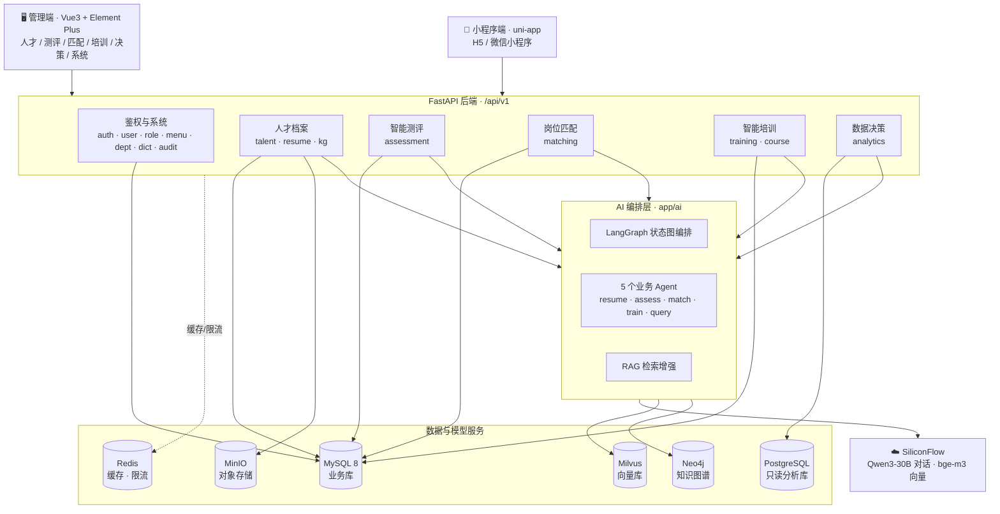
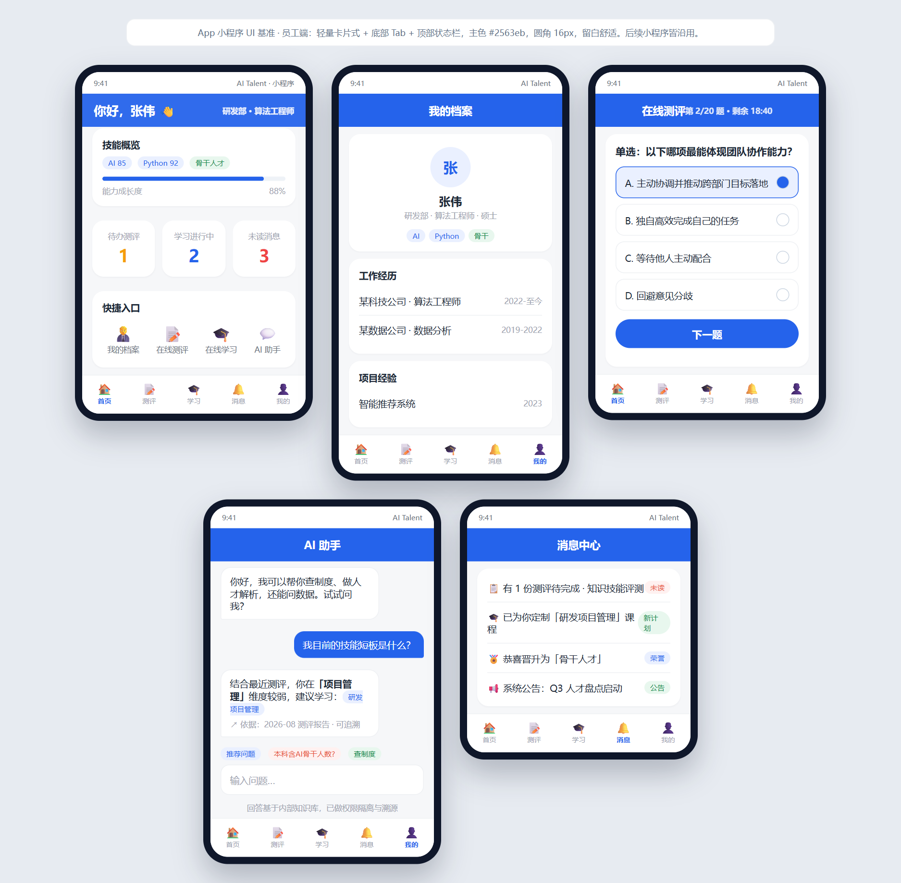
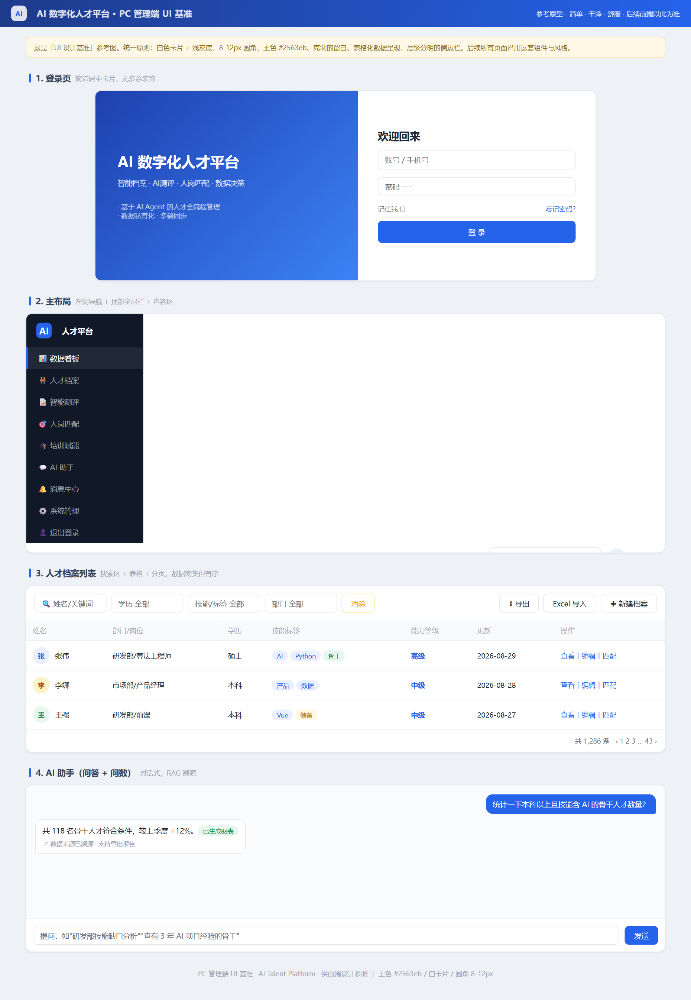
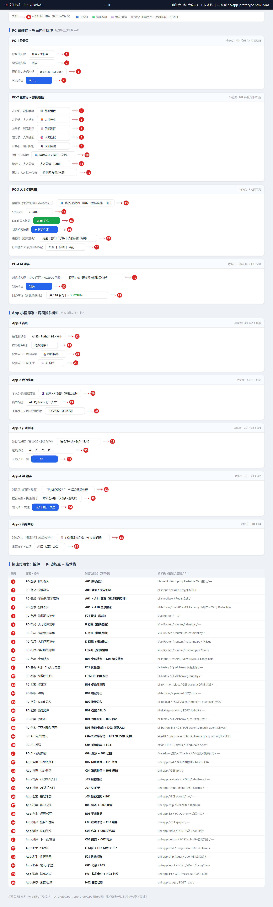
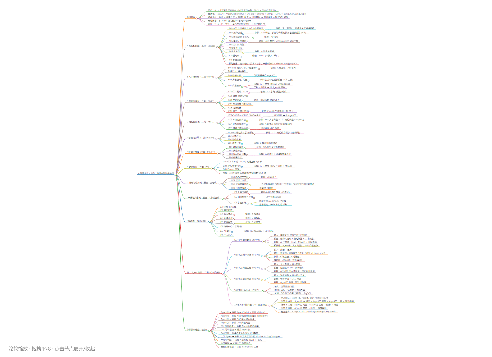

<div align="center">

# 🎯 AI 数字化人才平台 · AI Talent Platform

**人才「入库 → 测评 → 匹配 → 培训 → 决策」全链路的 AI 数字化管理平台**

三端协同（管理端 / 小程序端 / 后端）+ 5 个 AI Agent 编排 + RAG 知识库 + 知识图谱


</div>

---

## 📖 项目简介

**AI 数字化人才平台**面向企业人才管理的完整业务闭环，用 AI 把原本靠人工、靠经验、靠表格的环节自动化：

| 传统痛点 | 平台解法 | 承载模块 |
|---|---|---|
| 简历靠人工逐份录入、格式五花八门 | 简历上传 → LLM 结构化解析 → 标签化入库 → 自动向量化 | `talent` + Agent① |
| 能力评估主观、缺乏统一口径 | 题库 / 组卷 / 在线作答 / 自动判分 / 能力雷达 | `assessment` + Agent② |
| 岗位与人才靠肉眼比对 | 语义匹配 + 三维向量画像 + 匹配解释 | `matching` + Agent③ |
| 培训大水漫灌、无针对性 | 依据测评短板个性化推荐课程与学习计划 | `training` + Agent④ |
| 想看数据必须找开发写 SQL | 自然语言问数（NL2SQL）直出图表 | `analytics` + Agent⑤ |

平台采用**三端分离**：管理端（Vue3 + Element Plus）、小程序端（uni-app，可编译 H5 / 微信小程序）、后端（FastAPI，`/api/v1`）。

---

## 🧭 业务全景（六大域）

| 业务域 | 路由前缀 | 核心能力 |
|---|---|---|
| 🔐 **登录鉴权与系统** | `/auth` `/users` `/roles` `/menus` `/depts` `/dicts` `/audit` | 账号密码 / 微信登录、JWT 签发与 refresh 续期、RBAC 权限、菜单动态下发、部门树、字典、操作与登录日志 |
| 👤 **人才档案入库** | `/talent` `/resume` `/talent-dict` `/kg` | 人才 CRUD、简历上传解析、标签体系、去重合并、档案治理、简历问答（RAG）、知识图谱同步 |
| 🧪 **智能测评** | `/assessment` | 题库管理、智能组卷、在线作答、客观题自动判分、主观题 AI 评分、能力雷达、测评报告、**视觉防作弊** |
| 🎯 **岗位匹配** | `/matching` | 岗位管理、JD 自动解析与向量化、人才语义匹配、匹配结果排序与解释、跟进提醒、Agent 交互 |
| 📚 **智能培训** | `/training` `/course` | 课程库与视频管理、学习计划、个性化推荐、培训效果评估、学习进度追踪 |
| 📊 **数据决策** | `/analytics` | 数据看板、指标分布与筛选、导出、**NL2SQL 自然语言问数** |
| 🤖 **AI 编排** | `/ai` `/ai/graph` | LangGraph 多 Agent 协同、意图路由、统一 LLM 出口 |

---

## 🤖 核心 AI 能力

### 五个业务 Agent（`app/ai/agents/`）

| Agent | 文件 | 职责 |
|---|---|---|
| ① 简历解析 | `resume_agent.py` | 非结构化简历 → 结构化人才档案 + 标签抽取 |
| ② 测评分析 | `assess_agent.py` | 作答结果 → 能力维度分析 + 测评报告生成 |
| ③ 岗位匹配 | `match_agent.py` | 人才画像 × 岗位要求语义匹配 + 匹配理由解释 |
| ④ 培训推荐 | `train_agent.py` | 依据能力短板生成个性化学习计划 |
| ⑤ 智能问数 | `query_agent.py` | 自然语言 → SQL → 图表（NL2SQL） |

### 编排与基建

- **LangGraph 编排**（`app/ai/graph.py`）：多 Agent 状态图协同、意图识别与路由
- **RAG 知识库**（`app/utils/rag.py` + `vector_store.py`）：文档切块 → bge-m3 向量化 → Milvus 检索 → 增强问答
- **知识图谱**（`app/utils/neo4j_client.py` + `services/kg_sync.py`）：人才-技能-岗位关系图谱
- **LLM 统一出口**（`app/utils/llm.py`）：多后端策略可切换（SiliconFlow / Ollama），失败可降级
- **测评防作弊**（`services/assessment_vision_service.py`）：YOLOv8 视觉检测，置信度阈值可配

> 大模型默认走**硅基流动（SiliconFlow）**：对话 `Qwen/Qwen3-30B-A3B-Instruct`，向量 `BAAI/bge-m3`；可通过 `LLM_STRATEGY` 切换到本地 Ollama。

---

## 🏗 系统架构



---

## 🖼 界面原型

> 以下为项目配套的**设计原型与标注文档**（`.html` 源文件已随仓库提供，位于 `design/` 与 `docs/`）。

### 📱 小程序端原型

<a href="docs/screenshots/app-prototype.png"></a>

### 🖥 管理端 PC 原型

<a href="docs/screenshots/pc-admin-prototype.png"></a>

### 🎨 UI 控件标注 · 功能点 ↔ 技术栈映射

<a href="docs/screenshots/ui-annotation.png"></a>

### 🧠 项目全景思维导图

<a href="docs/screenshots/project-mindmap.png"></a>

---

## 🧰 技术栈

| 层次 | 技术选型 |
|---|---|
| 后端 | FastAPI · Uvicorn · Pydantic v2 · SQLAlchemy 2.x · Alembic（迁移版本化）· PyJWT |
| 管理端 | Vue 3（`<script setup>`）· Element Plus · Pinia · Vue Router · Vite · ECharts |
| 小程序端 | uni-app · Vue 3 · Pinia（可编译 H5 / 微信小程序） |
| 关系库 | MySQL 8（业务）· PostgreSQL 16（只读分析链路） |
| 缓存 / 限流 | Redis（登录与 AI 接口限流、看板缓存、分布式锁） |
| 向量 / 图谱 | Milvus 2.6（bge-m3 向量）· Neo4j（人才知识图谱） |
| 对象存储 | MinIO |
| 大模型 | SiliconFlow（Qwen3-30B-A3B 对话 / bge-m3 向量）· Ollama（本地备选） |
| AI 编排 | LangGraph（多 Agent 状态图）· RAG（切块 + 向量召回） |
| 视觉模型 | YOLOv8（`yolo11n.pt`，测评视觉防作弊） |
| 工程化 | pytest · 前后端启停脚本 · 开发辅助 Skill（`skills/dev-expert`） |

---

## 📂 目录结构

```
ai_talent/
├── app/                          # FastAPI 后端
│   ├── main.py                   # 应用入口（含启动自动建表）
│   ├── core/                     # config 配置 / security 加密 / deps 依赖注入
│   ├── db/                       # session / base / init_db（建表 + 种子数据）
│   ├── models/                   # SQLAlchemy ORM（talent / assessment / matching / training / course / agent ...）
│   ├── schemas/                  # Pydantic 出入参契约
│   ├── dao/                      # BaseDAO 通用 CRUD + 各表 DAO
│   ├── services/                 # 业务服务（talent / matching / assessment / analytics / resume ...）
│   ├── routers/                  # 20 个路由模块，由 api.py 统一挂载
│   ├── agents/                   # 测评 / 培训专用 Agent + SiliconFlow 客户端
│   ├── ai/                       # AI 编排域：LangGraph 图 + 5 个业务 Agent
│   ├── middleware/               # AuditMiddleware 操作留痕（业务零侵入）
│   ├── exceptions/               # 业务异常与统一错误处理
│   └── utils/                    # llm / rag / vector_store / neo4j / object_storage / masking ...
├── admin_web/                    # 管理端（Vue3 + Element Plus）
│   └── src/views/                # analytics / assessment / course / matching / system / talent / training
├── miniapp/                      # 小程序端（uni-app + Vue3）
│   └── src/pages/                # index / login / profile / assessment / study / matching / ai / message / mine
├── design/                       # 原型与 UI 标注（HTML）
├── docs/                         # 需求 / 计划 / 分工 / 数据库审计 / 测试用例 / 答辩讲稿
├── alembic/                      # 数据库迁移脚本
├── scripts/                      # 启停脚本、种子数据、向量化、验证脚本
├── skills/                       # 开发辅助 Skill（含密钥扫描钩子）
├── tests/                        # pytest 用例 + 岗位匹配 300 条测试用例
├── .env.example                  # 环境变量模板（真实 .env 不入库）
├── requirements.txt              # 后端依赖
└── docker-compose.yml            # 本地依赖服务编排
```

---

## 🚀 快速开始

### 环境依赖

| 服务 | 默认地址 | 用途 |
|---|---|---|
| MySQL 8 | `127.0.0.1:3306` | 业务主库（`ai_talent`） |
| Redis | `localhost:6379` | 缓存、接口限流、分布式锁 |
| Milvus | `127.0.0.1:19530` | 向量检索（要求 pymilvus ≥ 2.6.x，与 2.6.x 服务端对齐） |
| Neo4j | `bolt://localhost:7687` | 人才知识图谱 |
| PostgreSQL 16 | `localhost:5433` | 只读分析库（NL2SQL 链路） |
| MinIO | `127.0.0.1:9000` | 简历 / 文件对象存储 |
| SiliconFlow | API Key | 大模型对话与向量化 |

> 连接地址、端口与凭据均通过 `.env` 配置，**不写入仓库**。参考 `.env.example` 填写。

### 1. 后端（端口 8000）

```bash
# 在项目根目录创建 .env，按 app/core/config.py 的字段填写
# （数据库连接、SECRET_KEY、Redis / Milvus / Neo4j / MinIO、SiliconFlow API Key）

# 启动（必须从项目根目录、用模块模式运行）
conda activate talent          # 或使用你自己的虚拟环境
uvicorn app.main:app --reload
```

> ⚠️ 必须从根目录用模块模式启动，**不要**直接 `python app/main.py`（会导致 `sys.path` 错误）。
> 接口文档：http://127.0.0.1:8000/docs

### 2. 管理端（`admin_web/`，端口 5173）

```bash
cd admin_web
npm install
npm run dev
```

### 3. 小程序端（`miniapp/`，端口 5174）

```bash
cd miniapp
npm install
npm run dev:h5 -- --port 5174    # H5 预览
```

> 真正的体验请用**微信开发者工具**导入 `miniapp/dist/dev/mp-weixin`。
> 注意：根路径 `/` 会 404，H5 首页实际是 `#/pages/index/index`。

也可以用 `scripts/` 下的启停脚本：`start-backend.bat` / `start-admin-web.bat` / `start-miniapp.bat`。

### 4. 数据库迁移（Alembic）

```bash
# 修改 models/ 后生成迁移脚本并应用（Windows 下加 PYTHONUTF8=1 避免编码报错）
PYTHONUTF8=1 alembic revision --autogenerate -m "描述"
PYTHONUTF8=1 alembic upgrade head

alembic current        # 查看当前版本
alembic downgrade -1   # 回滚一步
```

> 禁止手工 `ALTER` 数据库，表结构变更一律走迁移脚本。

---

## 🔌 接口速览

统一前缀 `/api/v1`，统一响应 `{ "code": 0, "message": "ok", "data": ... }`，
鉴权头 `Authorization: Bearer <token>`，分页返回 `items + meta{page, page_size, total}`。

| 模块 | 代表接口 |
|---|---|
| 认证 | `POST /auth/login` `POST /auth/refresh` `POST /auth/logout` `POST /auth/wechat` |
| 用户 / 角色 / 菜单 | `GET/POST /users` `GET/POST /roles` `GET /menus/mine` |
| 部门 / 字典 | `GET/POST /depts` `GET/POST /dicts/types` `GET /dicts/items/{type_code}` |
| 消息 | `GET/POST /messages` `POST /messages/{id}/read` `GET /messages/unread-count` |
| 审计 | `GET /audit/logs` `GET /audit/login-logs` |
| 人才档案 | `GET/POST /talent` `POST /resume/upload` `GET /kg/…` |
| 智能测评 | `GET/POST /assessment/…`（题库 / 组卷 / 作答 / 判分 / 报告） |
| 岗位匹配 | `GET/POST /matching/…`（岗位 / 匹配 / 结果 / 跟进） |
| 智能培训 | `GET/POST /training/…` `GET/POST /course/…` |
| 数据决策 | `GET /analytics/…`（看板 / 分布 / 导出 / NL2SQL） |
| AI 编排 | `POST /ai/chat` `POST /ai/graph/…` |
| 健康检查 | `GET /health` |

完整接口请查看 Swagger UI。

---

## 🧩 工程规范

### 分层约定（单向依赖）

```
router → service → dao → model
```

- `router` 只做参数校验与编排，不写业务逻辑
- `service` 承载业务与多表事务
- `dao` 继承 `BaseDAO`，新表只需标注 `__model__` 即可获得通用 CRUD
- 横切能力零侵入接入：
  - 权限：`dependencies=[Depends(require_permission("talent:list"))]`
  - 操作留痕：`AuditMiddleware` 全局自动
  - 消息推送：`MessageService.send(...)` 一行
  - AI：`get_rag()` / `get_llm()`，无需感知底层

### 新增一个业务模块（五步）

1. **model**：`models/xxx.py` 定义 ORM 并在 `models/__init__.py` 导出
2. **schema**：`schemas/xxx.py` 写 Create / Update / Query / Out
3. **dao**：`dao/xxx.py` → `class XxxDAO(BaseDAO[Xxx]): __model__ = Xxx`
4. **service**：`services/xxx_service.py` 写业务逻辑
5. **router**：`routers/xxx.py`，并在 `routers/api.py` 挂载
6. （前端）管理端照 `system/user.vue`，小程序照 `message.vue`

---

## 🧪 测试

```bash
pytest                      # 运行后端用例
```

覆盖范围包括：测评身份迁移、测评-培训联动、历史人才数据清理、消息投递、Redis 特性、种子数据等。
`tests/test_cases/` 另有**岗位匹配模块 300 条测试用例**及执行报告。

---

## 📑 文档索引

| 文档 | 内容 |
|---|---|
| [`docs/01-需求分析.md`](docs/01-需求分析.md) | 需求分析 |
| [`docs/02-项目开发计划.md`](docs/02-项目开发计划.md) | 开发计划 |
| [`docs/04-基座使用手册.md`](docs/04-基座使用手册.md) | 基座框架使用说明 |
| [`docs/07-Agent接口契约.md`](docs/07-Agent接口契约.md) | Agent 接口契约定义 |
| [`docs/08-模块测试用例.md`](docs/08-模块测试用例.md) · [`09-系统测试用例.md`](docs/09-系统测试用例.md) | 测试用例 |
| [`docs/10-数据库表设计差异与决策清单.md`](docs/10-数据库表设计差异与决策清单.md) | 数据库设计决策 |
| [`docs/11-小程序设计思路.md`](docs/11-小程序设计思路.md) | 小程序端设计 |
| [`docs/基础框架架构设计.md`](docs/基础框架架构设计.md) | 架构设计 |
| [`docs/权限设计文档.md`](docs/权限设计文档.md) | RBAC 权限设计 |
| [`docs/13-现场答辩讲稿-岗位匹配模块.md`](docs/13-现场答辩讲稿-岗位匹配模块.md) | 岗位匹配模块答辩讲稿 |
| [`AGENTS.md`](AGENTS.md) | 面向 AI 协作者的工程约定 |

---

## 🔒 安全与合规

- `.env`、`*.log`、`node_modules/`、构建产物均已加入 `.gitignore`，**不入版本库**
- 仓库内置密钥扫描钩子（`skills/dev-expert/hooks/secret_scan.py`），提交前自动检查敏感信息
- 数据库连接与密钥请通过环境变量注入，生产环境务必更换默认凭据并使用独立密钥管理
- 涉及个人简历与人才数据，请按所在地区的数据保护法规部署与使用

---

<div align="center">

**AI 数字化人才平台 · 2026 顶配版**

欢迎交流指导 🙌

</div>
